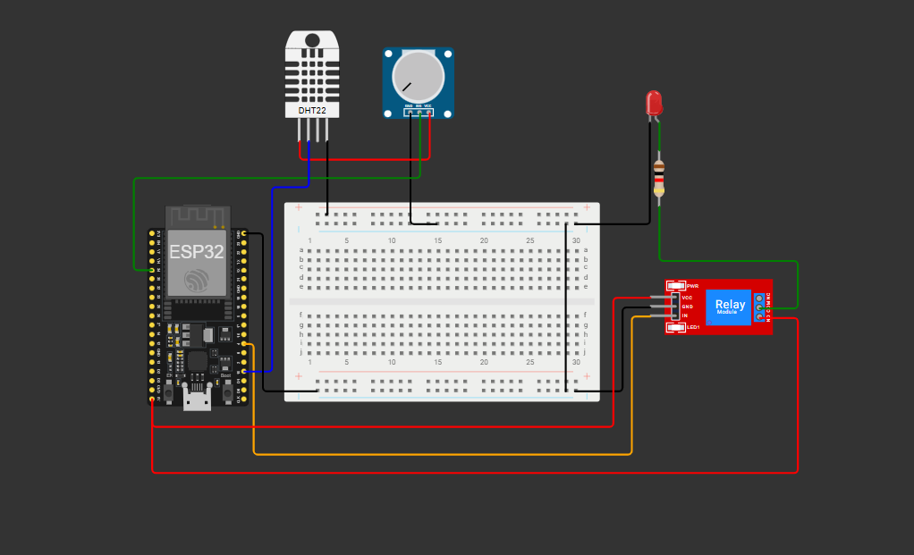

This is a smart irrigation system project built and simulated in Wokwi

A **Potentiometer** is used to simulate the analog signal from a **Soil Moisture Sensor**.

An **LED** is used to represent the **DC Motor** (or water pump). 
The simulation code is in the `sketch.ino` file.
